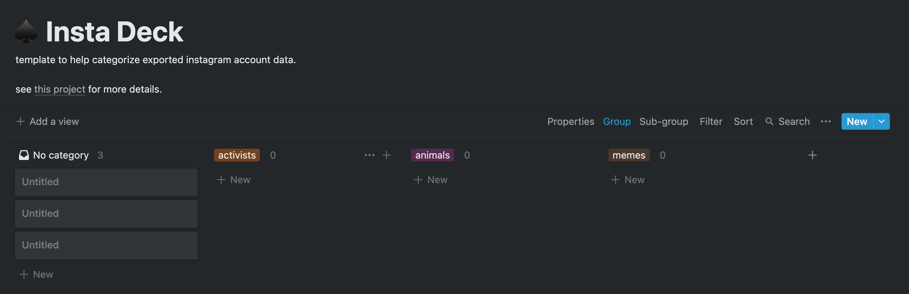

# insta_deck
like tweet deck, but for instagram

## usage
1. install the dependencies
```
python3 -m venv .venv
source .venv/bin/activate
pip3 install --upgrade pip && pip3 install -r requirements.txt
```
2. add your instagram account info to a file called `env.json` in the following format
```
{
    "ACCOUNTS": [
        {
            "INSTAGRAM_USER": "your-username",
            "INSTAGRAM_PASSWORD": "your-password",
            "MAIN_ACCOUNT": true
        }
    ]
}
```
3. export a csv file of all the accounts you follow
```
python scripts/export_accounts.py
```
4. duplicate [this template](https://www.notion.so/tngzng/5756d62703454f519107423dafbe0925?v=f3d0284f90ff4c53af4d1c7ac420fcbf) in notion and [import](https://www.notion.so/Import-data-into-Notion-18c37b470e8941789548b68049af750b) the csv of followed accounts to notion 
5. categorize the accounts by dragging them under the category header that fits best. (you can make your own categories too!)

7. export the categorized account info from notion in the ["Markdown & CSV"](https://www.notion.so/help/export-your-content) format and move it to the `uploads` folder in a file named `categorized_accounts.csv`
8. add info for additional instagram accounts to the `env.json` file in the following format. `FOLLOW_CATEGORIES` should use the notion categories you applied in step 5, specifying "+" to start following accounts in a category or "-" to unfollow accounts in a category
```
{
    "ACCOUNTS": [
        {
            "INSTAGRAM_USER": "your-username",
            "INSTAGRAM_PASSWORD": "your-password",
            "FOLLOW_CATEGORIES": [
                "-unfollow"
            ]
            "MAIN_ACCOUNT": true
        },
        {
            "INSTAGRAM_USER": "your-username",
            "INSTAGRAM_PASSWORD": "your-password",
            "FOLLOW_CATEGORIES": [
                "+close friends"
            ]
        }
    ]
}
```
7. follow (and unfollow) accounts in the categories you specified above (this may take some time)
```
python scripts/follow_accounts.py
```
8. log into your new accounts to start using your insta deck 😎
